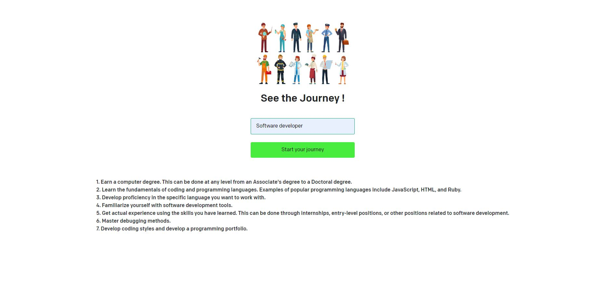

## LEARNING ChatGPT APIs

# OpenAI API - 'How to become a ....' app
This repo is based to learn different API and models of ChatGPT
` Only for learning purposes ` 

## Setup
1. Clone this repository

2. Install the requirements
   ```bash
   $ npm install
   ```

3. Make a copy of the example environment variables file
   On Linux systems: 
   ```bash
   $ cp .env.example .env
   ```
   On Windows:
   ```powershell
   $ copy .env.example .env
   ```

4. Add your [API key](https://beta.openai.com/account/api-keys) to the newly created `.env` file

5. Run the app

   ```bash
   $ npm run dev
   ```

You should now be able to access the app at [http://localhost:3000](http://localhost:3000)!

## Description
* User is able to search for a profession what they want to pursue/learn about in detail.

* The results gives the necessary steps need to be taken to become a professional in the specified field.

## Screenshot

